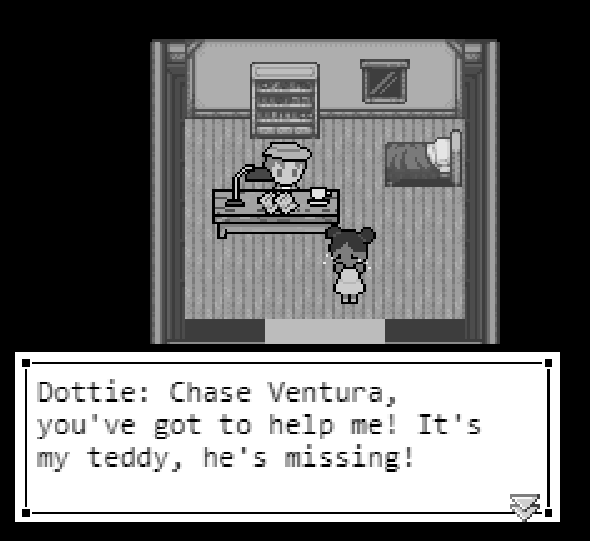
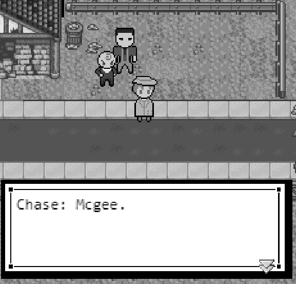
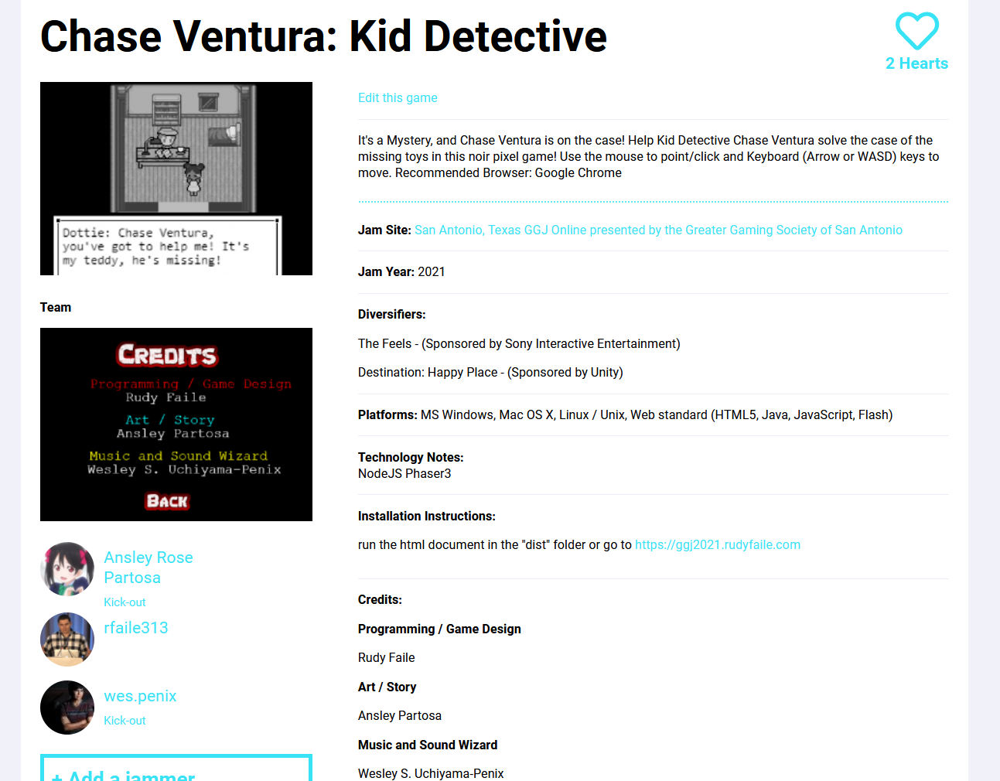
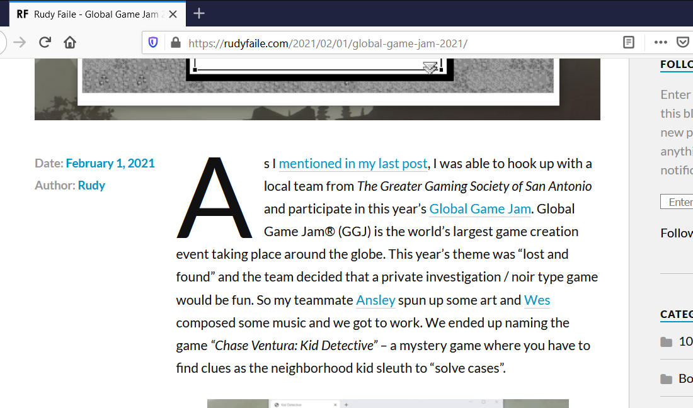

# Global Game Jam 2021 (GGJ2021)

## Chase Ventura: Kid Detective

#### Play online here:

https://ggj2021.rudyfaile.com/ 

Recommended Browser: Google Chrome

  

### This was my team's submission for Global Game Jam 2021. Global Game Jam® (GGJ) is the world’s largest game creation event taking place around the globe. This year’s theme was “lost and found” and the team decided that a private investigation / noir type game would be fun.

#### Please note that this is a Game Jam Game built under a time constraint, so the code isn't very good. Lots of repeats, hardcoded values, and other basic mistakes that go against most coding best practices. In a proper project, there are a lot of things that would be done differently 😀

#### Description: It's a Mystery, and Chase Ventura is on the case! Help Kid Detective Chase Ventura solve the case of the missing toys in this noir pixel game! Use the mouse to point/click and Keyboard (Arrow or WASD) keys to move. Recommended Browser: Google Chrome

#### GameJam Submission page:

#### Blog post:

#### Dev:

1. `git clone https://github.com/rfaile313/global-game-jam-2021.git`
2. `cd global-game-jam-2021`
3. `npm install`
4. `npm start`
